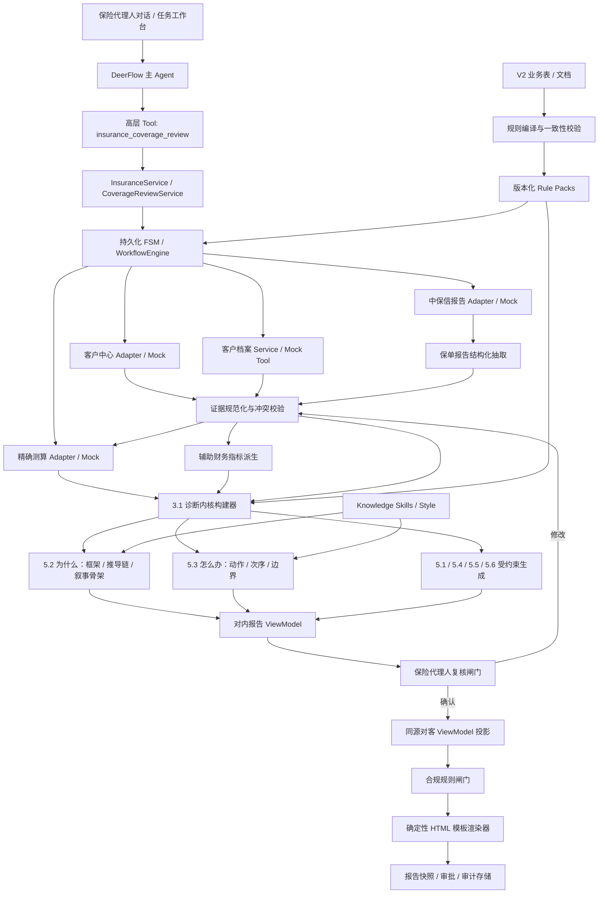
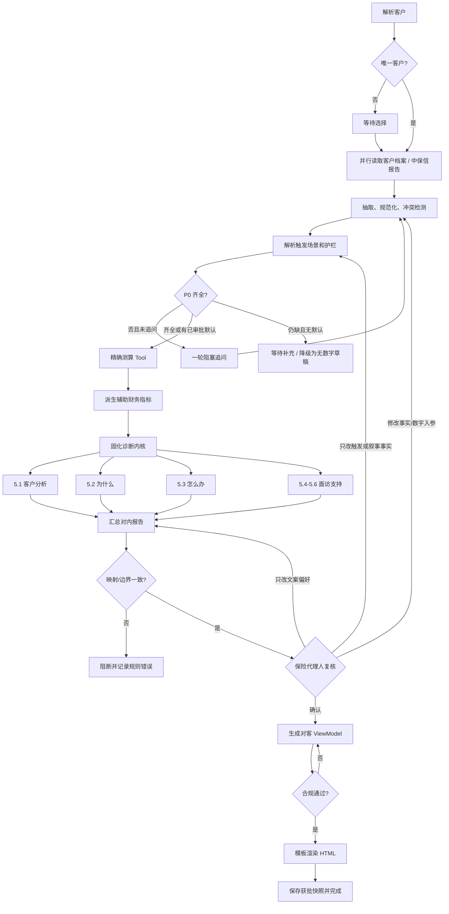

# 产品销售智能体保障检视模块技术设计

> 文档状态：方案评审稿  
> 版本：v2.1  
> 日期：2026-07-15  
> 适用代码库：DeerFlow `insurance_product_sales` 分支  
> 本文只描述目标架构与实施方案，不代表当前代码已经实现。
> 业务基线：`07142043` 最新流程、触发场景 V2、5.2/5.3 V2 和理由码全覆盖表 V2。

## 1. 文档目的

本文在业务材料和现有 DeerFlow 代码框架的基础上，回答以下问题：

1. 保障检视模块的业务边界、事实源和完整流程是什么。
2. 哪些环节应由确定性工作流、Tool、Skill 或 LLM Agent 承担。
3. 客户中心、客户档案、中保信报告、精确测算工具如何 Mock，并为以后真实接口替换预留边界。
4. 如何构造不产生叙事的诊断内核，并保证对内、对外报告同源。
5. 如何实现保险代理人复核闸门，以及修改后的重新测算和版本追踪。
6. 如何用模板化 Harness 降低对客 HTML 对模型编码能力的依赖。
7. 现有代码哪些可以复用，哪些必须调整。
8. 1.3、3.1、5.2、5.3 如何通过统一理由码和规则版本保持接口闭合。

## 2. 业务背景与目标

保障检视不是产品推荐，也不是让模型自行推算保额。它是一条受控的业务流水线：

`找资料 -> 确认触发场景与缺失信息 -> 调用权威测算 -> 固化诊断事实 -> 生成对内报告 -> 保险代理人复核 -> 生成对客报告`

模块的核心目标是：

- 汇总客户、家庭、财务和保单证据。
- 调用公司精确测算工具，取得唯一权威的已有值、理想值和缺口值。
- 固化疾病、医疗、伤残、护理、身故、财富、养老、传承八类缺口，不把辅助财务指标扩成第九类缺口。
- 将缺口、充足项、保留项、纠错项、优先级和假设固化为不可变诊断快照。
- 为保险代理人生成完整的对内诊断材料。
- 在保险代理人确认或修改后，基于获批快照生成对客 HTML。
- 保证数字可追溯、两版同源、客户版不泄露内部判断。

### 2.1 本期范围

- 按客户姓名解析客户身份。
- Mock 客户中心五项信息接口。
- Mock 项目内部客户档案工具。
- Mock 中保信保单检视报告工具，并抽取结构化保单证据。
- 触发场景识别、复合触发合成和情绪护栏。
- 按字段重要度和信息增益向保险代理人追问。
- Mock 保障检视精确测算工具。
- 固化诊断内核。
- 生成对内 Markdown 报告。
- 支持保险代理人通过对话修改、确认。
- 基于获批版本生成对客 HTML。
- 接入保险知识 Skill，辅助客户分析、风险解释、面访计划、话术和异议处理。

### 2.2 非本期范围

- 具体保险产品推荐、产品组合、保费报价、收益演示。
- 自动投保、自动发送客户报告等不可逆动作。
- 模型自行替代公司测算工具重算缺口。
- 将书籍知识当成现行法律、监管规则或客户事实。
- 在没有证据的情况下评价某张旧保单条款优劣。

## 3. 材料理解与关键结论

### 3.1 已锁定的业务原则

1. **权威数字单一来源**：已有保障、理想值和缺口值来自“保障检视精确测算”工具，智能体不另算一套。
2. **事实和叙事分离**：诊断内核只保存结构化事实、数字、枚举、理由码和证据引用，不生成可直接对客户朗读的文字。
3. **同源投影**：对内报告和对客报告都读取同一诊断内核；对客报告不能基于对内自然语言继续加工。
4. **先内后外**：必须先生成对内报告并经过保险代理人确认，才能创建对客报告。
5. **触发场景控制调性**：最终调性由“情绪温度、客户类型、触发源”合成，情绪护栏优先级最高。
6. **追问对象是保险代理人**：只问保险代理人可能知道、系统又没有拿到的内容。
7. **阻塞追问与增益追问分离**：测算前最多一轮阻塞式追问；处境、目标和担忧等 P1 信息进入对内报告待确认清单，不阻塞测算。
8. **对客报告不进入产品层**：只说明保障方向、优先级、保留项和不建议动作，不输出具体产品或收益承诺。

### 3.2 材料中发现的数据风险

这些问题必须由规范化和校验层处理，不能交给报告模型自由判断：

- 中保信样例同时出现护理责任 `7688 万` 与 `0.768 万元`，存在明显单位或小数点冲突。
- 中保信家庭成员保单数之和大于总保单数，原报告说明存在投保人视图和被保人视图交叉，不能简单求和。
- 精确测算工具材料同时出现 `recommendFifst` 和 `recommendFirst`。
- 传承维样例复用了 `B1` 编码，与养老维冲突。
- 精确测算入参声明单位为万元，但示例值看起来像元，存在单位契约不一致。
- 工具名为精确测算，但示例响应中 `calculationType` 为 `fast`。
- 对内、对客历史样例包含具体产品形态和促成表达，超过本次“止于保障方向”的边界，不能原样复用。

结论：所有外部响应先进入 Adapter 和 Normalizer，再进入领域模型；原始响应不得直接成为诊断事实或报告 Prompt。

### 3.3 八类缺口的统一口径

`缺口项.jpg` 与本次业务说明共同构成最新权威口径。流程文档中仍出现的“六维”属于历史表述，本设计统一按八类缺口执行：

| 维度码 | 规范名称 | 展示分组 | 主要缺口理由码 |
|---|---|---|---|
| D1 | 疾病保障 | 健康保障 | `CRITICAL_ILLNESS_GAP` |
| D2 | 医疗保障 | 健康保障 | `MEDICAL_LIABILITY_GAP` |
| D3 | 伤残保障 | 健康保障 | `DISABILITY_GAP` |
| D5 | 护理保障 | 健康保障 | `LONGTERM_CARE_GAP` |
| D4 | 身故保障 | 健康保障 | `INCOME_REPLACE_GAP`、`DEBT_UNCOVERED` |
| A1 | 财富管理 | 财富保障 | `WEALTH_MGMT_GAP` |
| B1 | 养老储蓄 | 养老保障 | `RETIRE_CASHFLOW_GAP` |
| C1 | 传承储备 | 传承保障 | `LEGACY_ARRANGE_GAP` |

口径治理规则：

- 诊断内核固定保存八条 `dimensionFacts`；展示分组只影响渲染，不合并或丢弃原子事实。
- 八维顺序固定为：疾病、医疗、伤残、护理、身故、财富、养老、传承。对内、对客和测试使用同一顺序。
- D3 的规范名称和语义正式固定为“伤残保障”，规范理由码为 `DISABILITY_GAP`。V2 源表中的 `ACCIDENT_GAP` 只允许在规则编译入口作为历史源码迁移，运行时、新快照和报告均不得继续产出该码或“意外保障”名称。
- 应急流动性正式定性为辅助财务指标，规范提醒码为 `EMERGENCY_LIQUIDITY_ALERT`。V2 源表中的 `EMERGENCY_LIQUIDITY_GAP` 只作为历史源码迁移；该指标只进入 `auxiliaryDiagnostics`，不属于八类缺口，不参与缺口排序、5.3 行动波次或八维图表。
- 八类缺口名称、顺序、分组由版本化 `dimension_registry` 管理；工具原名和历史名称保留在来源元数据中，不直接面向客户。

历史源码到运行码的迁移规则：

| V2 源码 | v2.1 规范码 | 处理方式 |
|---|---|---|
| `ACCIDENT_GAP` | `DISABILITY_GAP` | 编译期迁移；运行期拒绝旧码 |
| `EMERGENCY_LIQUIDITY_GAP` | `EMERGENCY_LIQUIDITY_ALERT` | 编译期迁移；移出八维和 5.3 动作映射 |
| `RES_MISALLOC` | `STRUCTURE_MISALLOC` | 3.1 历史文档别名；运行期拒绝旧码 |

### 3.4 V2 资产一致性核对结论

本次对 1.3、3.1、5.2、5.3 和理由码总表逐项核对，得到以下结论：

1. 触发场景 V2 共 29 个场景，新增 `C6 主动问健康/重疾保障`；温度、客户类型和触发源的合成规则已闭合。
2. 5.2 与理由码全覆盖表均定义 20 个源理由码；经三条迁移规则编译后仍为 20 个唯一规范码。签名后的 `reason_registry.v2.1` 才是运行时唯一机器基准。
3. 5.3 动作表中的 `INCOME_REPLACE`、`DEBT`、`RETIRE` 等是人工阅读缩写，不能直接编译为运行配置；运行配置必须引用理由码总表中的完整码。
4. 3.1 Markdown 的 `RES_MISALLOC`、5.2/理由码表的 `ACCIDENT_GAP` 和 `EMERGENCY_LIQUIDITY_GAP` 均为源资产历史码，必须在编译期迁移，不能泄漏到运行快照。
5. 应急流动性已经确认为辅助财务指标，正式移除其“新单/加保”映射；它可在 5.1 或 5.2 作为家庭备用金观察呈现，但不形成保险动作。
6. 3.1、5.2、5.3 是同一诊断内核的独立投影，不是互相加工的链。5.2 失败不能影响 5.3 的事实和动作，反之亦然。

### 3.5 规则来源优先级与决策记录

当材料发生冲突时，按以下优先级收敛，不允许实现人员自行择一：

1. 已确认的专项业务决策和正式变更记录。
2. 最新流程、最新 V2 资产及配套截图。
3. 诊断内核核心目的总述。
4. 3.1 Markdown 细节设计。
5. 历史报告样例和旧流程文件。

本版已确认决策：

| 决策日期 | 决策项 | 正式结论 | 影响范围 |
|---|---|---|---|
| 2026-07-15 | D3 口径 | 正式调整为伤残保障 | 维度字典、理由码、测算 Adapter、5.2、报告、测试 |
| 2026-07-15 | 应急流动性 | 辅助财务指标，不是保障缺口 | 3.1 辅助域、5.2 可选说明、5.3 无动作、报告不进八维 |

## 4. 现有代码评估

### 4.1 可直接复用的底座

| 现有能力 | 代码位置 | 复用方式 |
|---|---|---|
| 可持久化工作流 | `backend/packages/harness/deerflow/workflows/` | 继续承载版本化 DAG、等待输入、暂停恢复和步骤状态 |
| 主体记忆 | `backend/packages/harness/deerflow/subject_memory/` | 保存客户档案版本、字段来源和候选更新 |
| 所有者隔离 | `backend/app/insurance/tools.py` | 保持 `owner_id` 从运行时解析，不暴露给模型 |
| 保险应用服务分层 | `backend/app/insurance/service.py` | 继续作为 API、Agent Tool 和工作流的统一入口 |
| 独立对内/对客 Schema | `coverage_review/models.py`、`reports.py` | 保留“白名单投影而非 Prompt 隐藏”的安全原则 |
| 乐观锁与任务版本 | Profile Service、Task Repository | 用于防止并发修改和过期审批 |
| 工作流 Tool 入口 | `insurance_coverage_review` | 扩展动作，不向主 Agent 暴露内部低层工具 |

### 4.2 必须调整的现状

| 当前实现 | 与目标的差异 | 目标调整 |
|---|---|---|
| `calculator.py` 自行计算保障维度并使用 DRAFT 参数 | 与“精确工具为唯一数字源”冲突 | 降级为规范化与派生指标模块，不再生成权威缺口 |
| `parameters.py` 保存保额测算参数 | 参数不应替代公司工具 | 改为诊断规则包、展示映射和护栏规则版本 |
| 客户版与内部版报告并行生成 | 客户版绕过保险代理人闸门 | 对内报告完成后进入人工复核，获批后才生成客户版 |
| `MockCustomerDataAdapter` 返回空 Patch | 不能模拟真实流程 | 拆成四个有契约、有错误场景的 Mock Adapter |
| 现有档案以 `customer_id` 查询 | 用户要求先按姓名查询 | 增加姓名解析与同名客户选择状态 |
| 现有模型缺少人生阶段、财富层级、触发和心理字段 | 无法驱动分线和调性 | 扩展快照模型，不把软信息强行写入权威档案 |
| Workflow Confirmation 只有布尔确认 | 无法承载“修改后重算” | 增加 Review Decision 与修订版本，支持局部失效和重跑 |
| 报告只生成 Markdown | 对客要求 HTML | 模型生成 JSON ViewModel，确定性模板渲染 HTML |
| `allowed_tools` 尚未完整执行权限拦截 | 不能只靠声明保证隔离 | 内部 Adapter 由应用服务注入，不直接暴露给主 Agent |

## 5. 总体架构

### 5.1 架构原则

- 主 Agent 管对话，不管理业务真相。
- FSM 管顺序和状态，不让模型自由规划保障检视流程。
- Tool 管数据读取、计算、持久化和渲染等可执行动作。
- Skill 管可复用知识、规则解释和结构化生成方法。
- 诊断内核是报告唯一事实底座。
- 业务 Excel 是评审资产，不是运行时 Prompt；发布时编译为可校验、可回放的规则包。
- 理由码、维度码、动作枚举和阶段能力必须机械校验，不依赖模型“记得一致”。
- 原始数据、规范化数据、诊断事实、报告文案分层保存。
- 对外输出采用白名单 ViewModel，不从内部报告做文本删除。
- 每个结论可追溯到来源、版本、工具调用和规则版本。

### 5.2 逻辑架构图



### 5.3 运行边界

Harness 层继续保持领域无关：

- `deerflow.workflows` 只理解任务、步骤、等待输入和确认。
- `deerflow.subject_memory` 只理解版本化主体文档。
- 保险字段、测算工具、诊断理由码和报告模板全部留在 `app.insurance`。

若需要“修改后局部重跑”这一通用能力，可在 Harness 增加通用的步骤失效机制，但 Harness 不能出现保险术语。

### 5.4 规则 Harness 发布与运行链

V2 Excel/Word 是业务评审源，不能由运行时 Agent 每次整表读取，也不能绕过已确认决策直接成为运行配置。建议建立以下发布链：

`业务源文件 + 决策覆盖表 -> 规则编译器/旧码迁移 -> Schema 校验 -> 交叉引用校验 -> Golden Case -> 签名规则包 -> 运行时只读加载`

规则包至少拆为：

- `dimension_registry.v2.1`：八维名称、固定顺序、分组和 D3 正式语义。
- `decision_overrides.v2.1`：已确认决策及其对源表历史码/映射的覆盖，必须带审批记录。
- `trigger_tone.v2`：29 个触发、重心、温度、护栏和复合规则。
- `reason_registry.v2.1`：20 个规范理由码、类别、阶段和源码迁移记录。
- `diagnosis_rules.v2`：缺口态、无需求、保留/纠错、优先级、分线和置信度。
- `projection_5_2.v2.1`：规范理由码到框架、推导链、叙事骨架的映射。
- `projection_5_3.v2.1`：规范理由码到动作、波次、预算取舍和人工复核标记的映射。
- `boundary_guard.v2`：产品、保额、搭配、缴费、收益等机械禁用项。
- `style_contract.v2`：去 AI 味、降调、温度和禁用表达。

编译期必须执行：唯一性、枚举合法性、旧码迁移完整、完整码引用、阶段一致、八维子集、无孤儿理由码、无失效触发、第二阶段能力依赖等检查。还必须断言 `DISABILITY_GAP` 只绑定 D3、`EMERGENCY_LIQUIDITY_ALERT` 不绑定任何八维且没有 5.3 保障动作。任何错误都阻断规则包发布。

运行时 Harness 固定为：

1. 选择器读取内核和规则包，确定框架、动作、波次与护栏。
2. Prompt Builder 只放入被选中的少量规则和白名单事实，不把整张表或原始报告塞给模型。
3. 模型输出 JSON，不输出 Markdown/HTML；温度低、Tool 关闭、字段封闭。
4. Schema Validator 校验类型、枚举、引用和数字来源。
5. Consistency Gate 校验 3.1/5.2/5.3 同源和理由码闭合。
6. Boundary Guard 机械拦截越界内容。
7. Renderer 生成对内 Markdown 或对客 HTML。

签名 Manifest 必须记录全部源文件哈希、决策覆盖表哈希、编译器版本、20 码集合哈希和 Golden Case 结果。诊断快照保存 Manifest 哈希，确保同一输入可以按当时规则精确重放。

模型兜底只用于半结构化抽取、触发候选分类和受控语言生成。规则选择、数值计算、优先级、动作、阶段能力、审批和 HTML 结构均不得由模型兜底；模型失败时保留结构化骨架并允许单节点重试。

## 6. Agent、Skill、Tool 的职责划分

### 6.1 Agent

本模块只保留一个长期对话 Agent：DeerFlow 主 Agent。

主 Agent 负责：

- 理解保险代理人的意图。
- 发起、查询、暂停、恢复保障检视任务。
- 把工作流产生的结构化问题转达给保险代理人。
- 把保险代理人的回答提交给工作流。
- 展示对内报告并收集“确认/修改”决定。

主 Agent 不负责：

- 自由规划保障检视步骤。
- 直接调用精确测算低层接口。
- 自行计算缺口或改写工具数字。
- 决定情绪护栏、审批状态或对客字段白名单。
- 自由编写 HTML/CSS。

客户分析、保单抽取、报告撰写和合规复核可以调用模型，但它们应作为**受 Schema 约束的模型型 Skill 节点**运行，不作为可自由循环和自行选工具的独立子 Agent。

### 6.2 两类 Skill 的区分

项目中“Skill”有两层含义，实施时必须区分：

1. **Executable Skill**：`SkillDefinition + SkillHandler`，是工作流步骤的机器契约。
2. **Knowledge Skill**：磁盘中的 `SKILL.md`，为模型提供知识、方法和输出约束。

Executable Skill 决定“节点怎么运行”，Knowledge Skill 决定“模型在该节点应怎样思考和表达”。Knowledge Skill 不直接拥有数据库或外部接口权限。

### 6.3 建议的 Executable Skills

| Skill | 类型 | 是否调用模型 | 输出 |
|---|---|---:|---|
| `coverage-resolve-customer` | 数据解析 | 否 | 唯一客户或候选列表 |
| `coverage-load-profile` | 读取 | 否 | 客户档案证据包 |
| `coverage-load-policy-report` | 读取 | 否 | 原始中保信报告及元数据 |
| `coverage-extract-policy-evidence` | 结构化抽取 | 是，受限 | 带原文定位的保单证据 |
| `coverage-normalize-evidence` | 规则 | 否 | 统一字段、冲突、缺失项 |
| `coverage-resolve-trigger` | 规则加结构化理解 | 可选 | 主触发、复合触发、护栏 |
| `coverage-build-questions` | 规则加措辞 | 可选 | 一轮阻塞问题、P1 待确认项 |
| `coverage-call-precise-calculator` | 外部调用 | 否 | 规范化权威测算结果 |
| `coverage-derive-auxiliary-finance` | 派生规则 | 否 | 应急月数等辅助财务指标，不产生保障缺口 |
| `coverage-freeze-diagnosis-kernel` | 规则引擎 | 否 | 八维事实、优先级、保留/纠错、理由码、阶段能力 |
| `coverage-project-why` | 5.2 复合 Skill | 受限 | 框架选择、推导链、叙事骨架、利益语言 |
| `coverage-project-actions` | 5.3 复合 Skill | 受限 | 动作类型、行动波次、预算约束说明、交接声明 |
| `coverage-consistency-gate` | 机械校验 | 否 | 1.3/3.1/5.2/5.3 闭合结果 |
| `coverage-write-customer-analysis` | 内容生成 | 是 | 对内客户分析 JSON |
| `coverage-write-meeting-plan` | 内容生成 | 是 | 面访目标与计划 |
| `coverage-write-agent-script` | 内容生成 | 是 | 面访话术与异议处理 |
| `coverage-compose-internal-report` | 汇总渲染 | 否或轻模型 | 内部报告 ViewModel / Markdown |
| `coverage-agent-review-gate` | 人工确认 | 否 | 通过或修订请求 |
| `coverage-compose-customer-view` | 内容生成 | 是 | 对客白名单 ViewModel |
| `coverage-compliance-gate` | 规则加复核 | 可选 | 通过、拦截项、修订意见 |
| `coverage-render-customer-html` | 模板渲染 | 否 | HTML 及资源哈希 |

### 6.4 建议的 Knowledge Skills

新增本模块专用 Skill：

- `coverage-review-trigger-tone`：触发场景、复合触发、情绪护栏。
- `coverage-review-questioning`：P0/P1/P2、信息增益和一轮追问规则。
- `coverage-review-diagnosis`：诊断理由码、5.2 三类资产、5.3 三段资产和边界守卫。
- `coverage-review-internal-report`：对内报告结构和字段契约。
- `coverage-review-customer-report`：对客报告结构、场景模拟和禁用内容。
- `coverage-review-style`：去 AI 味、克制、有温度、数字锚定。

按场景路由已有书籍 Skill，不把全部书籍一次性塞入上下文：

| 用途 | 优先 Skill |
|---|---|
| 家庭风险与保险功能解释 | `family-insurance-quickstart` |
| KYC、客户分层和多重身份 | `insurance-precision-marketing` |
| 顾问式流程和建议书逻辑 | `professional-insurance-sales` |
| 面访场景与阶段推进 | `insurance-sales-scenarios`、`insurance-sales-playbook` |
| 异议分类与回应 | `insurance-sales-objection-handling` |
| 高客结构化分析 | `big-policy-sales`、`large-policy-practical-guide` |
| 婚姻、传承和家企边界 | `large-policy-family-law`、`large-policy-closing` |
| 合同和销售合规 | `insurance-contract-compliance` |

书籍 Skill 只提供方法和表达参考。客户事实以证据快照为准，法律税务结论以当前正式规则和专业复核为准。

### 6.5 Tool

只向主 Agent 暴露高层 Tool：

`insurance_coverage_review(action, customer_name/customer_id, task_id, payload)`

建议动作：

- `start`
- `status`
- `answer`
- `review`
- `suspend`
- `resume`
- `cancel`
- `get_internal_report`
- `get_customer_report`

低层接口由应用服务或工作流 Handler 调用，不直接暴露给主 Agent：

- Customer Center Adapter
- Customer Profile Adapter
- Zhongbaoxin Report Adapter
- Precise Calculator Adapter
- Report Snapshot Repository
- HTML Renderer

这样可以减少 Tool 选择错误，避免模型绕过工作流直接取敏感数据或生成未审批报告。

### 6.6 全流程职责归属

| 流程 | 主执行机制 | 模型角色 | 禁止交给模型的内容 |
|---|---|---|---|
| 1.1 客户中心/档案 | Workflow + Tool | 无；仅可解释报错 | 客户匹配、权限判断、字段覆盖 |
| 1.2 中保信 | Tool + 结构化抽取 Skill | 从半结构化文本抽取候选事实 | 单位校正、冲突裁决、把建议当事实 |
| 1.3 触发场景 | 规则配置 + 受限分类 | 自由文本映射为候选触发码 | 复合温度、护栏等级、禁用项 |
| 1.4 追问 | SOP + 字段注册表 | 合并和自然化问题、解析回答 | P0/P1 判断、默认值、轮次上限 |
| 2 精确测算 | Tool | 无 | 计算、改数、用本地算法替代失败工具 |
| 2A 辅助财务指标 | 代码公式 + 配置 | 无 | 形成第九类缺口、产生保险动作 |
| 3.1 诊断内核 | 代码规则 + 配置 | 无 | 缺口态、理由码、保留/纠错、置信度 |
| 3.2 排序/分线 | 代码规则 + 配置 | 无 | 重排、擅自判断高客、改权重 |
| 3.3 挂接触发 | Workflow + 代码 | 无 | 改写事实底座 |
| 4 代理人闸门 | FSM + 人工确认 | 抽取候选修改 | 自动审批、直接写内核 |
| 5.1 客户分析 | 受 Schema 约束的 Skill | 生成分析表达 | 新增客户事实 |
| 5.2 测算解读 | 确定性选择器 + Skill | 只在选中骨架内表达 | 换框架、重算数字、改理由码 |
| 5.3 决策建议 | 确定性映射 + Skill | 只做受控措辞 | 重排、产品推荐、投保级保额/预算方案 |
| 5.4-5.6 面访支持 | Knowledge Skill | 计划、话术、异议回应 | 越过护栏、创造事实或承诺 |
| 6 对客报告 | 白名单投影 + Skill + Renderer | 填写受控文本字段 | 生成整页 HTML/JS、读取内部字段 |
| 7 风格 | Style Skill + 检查器 | 克制改写 | 末端改写数字、事实或规则结论 |

这里的“保障检视 Skill”是业务能力名，不等于整段逻辑都由 LLM 完成。其内部应拆成确定性规则核心、受约束表达 Skill 和机械边界守卫三部分。

## 7. 目标工作流与 FSM

### 7.1 状态定义

| 状态 | 含义 | 稳定屏障 |
|---|---|---:|
| `CREATED` | 任务已创建 | 否 |
| `RESOLVING_CUSTOMER` | 按姓名查询客户中心 | 否 |
| `WAITING_CUSTOMER_SELECTION` | 同名客户需要人工选择 | 是 |
| `LOADING_EVIDENCE` | 并行读取档案和中保信报告 | 否 |
| `RESOLVING_TRIGGER` | 确认触发场景与护栏 | 否 |
| `WAITING_BLOCKING_INPUT` | 等待一轮 P0 补充 | 是 |
| `CALCULATING_PRECISE_GAP` | 调精确测算工具 | 否 |
| `DERIVING_AUXILIARY_METRICS` | 派生应急月数等辅助财务指标 | 否 |
| `FREEZING_KERNEL` | 固化诊断事实 | 否 |
| `PROJECTING_DIAGNOSIS` | 独立生成 5.2“为什么”和 5.3“怎么办”结构块 | 否 |
| `GENERATING_INTERNAL_REPORT` | 生成 5.1、5.4、5.5、5.6 并汇总对内报告 | 否 |
| `CHECKING_CONSISTENCY` | 校验 1.3/3.1/5.2/5.3 映射与边界 | 否 |
| `WAITING_AGENT_REVIEW` | 保险代理人查看、修改或确认 | 是 |
| `RECALCULATING` | 修改影响事实或测算入参后重跑 | 否 |
| `GENERATING_CUSTOMER_CONTENT` | 从获批内核生成对客 ViewModel | 否 |
| `COMPLIANCE_REVIEW` | 对客内容合规审查 | 否 |
| `RENDERING_CUSTOMER_HTML` | 套固定模板 | 否 |
| `COMPLETED` | 报告和审批快照完成 | 是 |
| `SUSPENDED/FAILED/CANCELLED` | 通用任务状态 | 是 |

### 7.2 目标 DAG



### 7.3 保险代理人修改的重跑规则

| 修改类型 | 示例 | 失效范围 |
|---|---|---|
| 身份或客户选择 | 选错同名客户 | 整个任务重建 |
| 权威事实/测算入参 | 收入、月支出、贷款、投资偏好 | 重新规范化、精确测算、辅助指标、内核、对内报告 |
| 保单事实 | 中保信报告补充、保单状态更正 | 保单抽取、精确测算、内核、对内报告 |
| 触发/处境事实 | 生育改为购房、增加身边确诊 | 触发合成、优先级、内核、对内报告 |
| 软性表达偏好 | 称呼、解释密度 | 只重建受影响报告模块 |

每次修改创建新的 `review_revision`。旧版不覆盖，审批只能绑定最新 revision 和输入哈希。过期页面提交的确认应返回冲突错误。

## 8. 数据架构

### 8.1 四层数据

1. **Raw Evidence**：原始接口响应、中保信原文、保险代理人原话。
2. **Normalized Evidence**：统一字段、单位、枚举、来源和冲突。
3. **Diagnosis Kernel**：从规范化证据和精确工具结果产生的事实快照。
4. **Report Projection**：对内/对客独立 ViewModel 和渲染产物。

上层只读下层，不能把报告文案反写为客户事实。

### 8.2 字段证据模型

每个规范化字段应包含：

```json
{
  "path": "/financial/annual_income",
  "value": "500000",
  "unit": "CNY/year",
  "source_type": "internal_profile",
  "source_ref": "profile:KH012:v7",
  "observed_at": "2026-07-14T10:00:00+08:00",
  "confirmed": true,
  "confidence": 1.0,
  "assumption": false,
  "conflicts": []
}
```

### 8.3 字段所有权与冲突规则

不采用一张全局优先级表，而按字段域确定权威来源：

| 字段域 | 首选来源 | 冲突处理 |
|---|---|---|
| 姓名、年龄、性别、人生阶段、财富水平 | 客户中心 | 与档案冲突时保留双方并提示人工确认 |
| 家庭、财务、职业、目标 | 内部客户档案 | 保险代理人本次明确更正可形成新档案版本 |
| 保单事实 | 中保信报告或正式保单系统 | 不采用报告中的主观建议作为事实 |
| 触发、担忧、情绪 | 本次保险代理人确认 | 不从财富标签自动推断心理状态 |
| 缺口数字 | 精确测算工具 | 模型和本地代码不得覆盖 |
| 法律、税务、合同结论 | 当前正式规则和专业复核 | 书籍 Skill 只作为问题识别框架 |

重大冲突不能静默选边。可以继续的字段使用首选来源并标注 `conflicted=true`，对内报告必须展示；影响精确工具入参的冲突进入阻塞追问。

### 8.4 客户档案字段映射

“字段清单·自行计算”中有三类内容：客户输入、绩优参数、推导公式。客户档案 Tool 只返回客户事实和逐单事实；绩优参数和公式不属于客户档案。

客户档案规范化后至少覆盖：

- 身份：客户 ID、姓名、年龄、性别、职业、职业风险类别、城市、婚姻、人生阶段、财富水平。
- 家庭：配偶、子女数量和年龄、父母赡养、家庭成员关系、经济支柱和收入占比。
- 财务：个人/配偶年收入、月支出、负债余额、大额贷款、流动资产、可变现金融资产、非流动资产、收入稳定性、投资偏好。
- 寿险需求事实：未偿负债、教育计划、赡养责任、承担支出、可变现资产。
- 重疾事实：年收入、已有重疾保额、家族病史。
- 医疗事实：社保类型、已有医疗责任、就医偏好。
- 伤残事实：职业风险类别、已有伤残责任、责任触发范围、伤残等级口径、出行频率。
- 养老事实：期望退休年龄、期望退休支出、社保养老金、商业养老现金流。
- 应急流动性辅助事实：家庭月支出、流动金融资产；只服务辅助诊断，不进入八类缺口。
- 逐单事实：险种、保额、保障期限/到期日、被保人、受益人、交费期和交费状态。

### 8.5 辅助财务指标模型

应急流动性不读取精确测算工具的八维缺口，也不复用 `dimensionFacts` 结构。它由确定性公式节点单独生成：

`liquidityMonths = liquidFinancialAssets / monthlyHouseholdExpense`

输出进入 `auxiliaryDiagnostics`：

```json
{
  "metricCode": "EMERGENCY_LIQUIDITY_MONTHS",
  "observedValue": 4.5,
  "unit": "month",
  "status": "observed_only",
  "alertReasonCode": null,
  "formulaVersion": "aux-finance-v1",
  "factRefs": ["..."],
  "eligibleForActionProjection": false
}
```

只有业务批准了月数阈值后，才允许把 `status` 分为充足/关注并产出 `EMERGENCY_LIQUIDITY_ALERT`。月支出缺失、为零或流动资产口径不明时输出 `unavailable`，不得填默认数。该指标最多进入 5.1 的客户分析和 5.2 的辅助说明，不进入 5.3、八维排序或保险动作。

## 9. Mock Tool 设计

Mock 需要模拟真实系统契约、延迟、错误和数据质量问题，而不是在业务代码中直接返回一个 Python 常量。

### 9.1 客户中心 Mock

用途：按姓名查询客户五项基础信息，并处理同名客户。

建议接口：

`GET /mock/customer-center/customers?name={name}`

响应：

```json
{
  "requestId": "cc-001",
  "candidates": [
    {
      "customerId": "KH012",
      "clientName": "王女士",
      "age": 38,
      "sex": "F",
      "lifeStageName": "育儿期",
      "wealthLevelName": "高净值"
    }
  ]
}
```

规则：

- 0 条进入 `CUSTOMER_NOT_FOUND`。
- 1 条自动选择。
- 多条进入 `WAITING_CUSTOMER_SELECTION`，向保险代理人展示脱敏区分项。
- 返回值带请求 ID、时间和 Mock 数据版本。

### 9.2 内部客户档案 Mock

用途：返回上一节定义的客户事实和逐单事实。

建议接口：

`GET /mock/customer-profiles/{customerId}`

响应必须区分：

- 字段未知：`null`
- 已明确没有：空数组或显式 `hasX=false`
- 接口未提供：字段不出现并在 `unsupportedFields` 列出

禁止把未知保单转换为空保单，否则会制造“完全没有保障”的假缺口。

### 9.3 中保信报告 Mock

用途：模拟内部工具返回半结构化保单检视报告。

建议接口：

`POST /mock/zhongbaoxin/policy-review-reports`

请求：

```json
{
  "customerId": "KH012",
  "asOfDate": "2026-07-14"
}
```

响应：

```json
{
  "reportId": "zbx-KH012-20260714",
  "generatedAt": "2026-07-14T10:05:00+08:00",
  "format": "markdown",
  "reportText": "...",
  "sourceVersion": "mock-zbx-v1",
  "checksum": "sha256:..."
}
```

Mock 场景至少包括：正常、无报告、超时、格式变化、单位冲突、总数冲突和重复保单。

### 9.4 精确测算 Mock

用途：模拟公司内网“保障检视-精确测算”工具，作为缺口数字唯一来源。

领域层先使用有单位的规范化请求，再由 Adapter 转换为工具字段：

```json
{
  "requestId": "calc-001",
  "idFamilyMember": "F30D...",
  "calculationType": "precise",
  "client": {
    "clientName": "王女士",
    "age": 38,
    "sex": "F",
    "lifeStageName": "育儿期",
    "wealthLevelName": "高净值"
  },
  "cardData": {
    "annualIncomeWan": "50",
    "spouseAnnualIncomeWan": "20",
    "familyExpenseYuanPerMonth": "20000",
    "largeLoanAmountWan": "100",
    "investmentRiskTolerance": "稳健型"
  }
}
```

规范化响应：

```json
{
  "requestId": "calc-001",
  "calculationType": "precise",
  "dimensionSemanticVersion": "coverage-dimensions-v2.1",
  "guaranteeRiskLevel": "medium",
  "points": [
    {
      "label": "now",
      "labelName": "现在",
      "age": 38,
      "dimensions": [
        {
          "groupCode": "D",
          "code": "D1",
          "name": "疾病保障",
          "existingCoverage": "0",
          "idealData": "200",
          "coverageGap": "200",
          "unit": "万元",
          "isFull": false,
          "recommendFirst": true
        }
      ]
    }
  ],
  "sourceVersion": "mock-precise-v1"
}
```

Adapter 校验：

- `calculationType` 必须与请求一致。
- 统一 `recommendFifst` 拼写问题。
- 检查维度码唯一性和组内合法性。
- 校验八类维度集合完整；D3 必须符合 `coverage-dimensions-v2.1` 的伤残语义。
- 若真实工具仍返回旧语义版本、仅给出“意外”标签或无法证明 D3 已升级，不得通过改名把旧金额解释为伤残缺口；应标记 `DIMENSION_SEMANTIC_VERSION_MISMATCH` 并阻断生产内核固化。
- 检查金额非负、单位明确。
- 检查 `existing + gap` 与 `ideal` 的关系，只报警，不擅自改工具值。
- 对异常数量级给出 `data_quality_flags`。
- 超时或 5xx 不得自动切换成本地自算；是否允许 fast 降级必须由显式业务配置和人工知情决定。

### 9.5 Mock 的可测试性

通过固定 fixture 和请求头选择场景，例如：

`X-Mock-Scenario: success | duplicate-name | timeout | unit-conflict | malformed`

所有 Mock 响应应确定性可重复，并记录 `fixtureVersion`。生产 Adapter 与 Mock Adapter 实现同一个 Protocol，业务工作流不感知具体实现。

## 10. 中保信报告抽取设计

### 10.1 抽取范围

只抽取能够支持检视的事实：

- 有效保单总数、险种分布。
- 被保人、家庭角色和保单数量。
- 累计保费、未来待缴保费和缴费时间。
- 保单/责任类型、产品名称、保额、期限、续保线索。
- 身故、重疾、医疗、伤残、年金/养老、护理等已有保障。
- 报告中明确指出的责任重叠或期限风险，作为“来源建议”，不直接升级为诊断事实。
- 抽取不到的逐单字段和条款字段。

### 10.2 抽取输出

```json
{
  "reportId": "zbx-...",
  "facts": [],
  "policies": [],
  "aggregates": [],
  "sourceRecommendations": [],
  "conflicts": [],
  "unresolved": [],
  "qualityScore": 0.82
}
```

每条事实包含：

- 规范化值和单位。
- 原文片段位置，如标题、表格行或字符区间。
- 抽取方式和置信度。
- 是否与报告其他位置冲突。

### 10.3 抽取方法

采用“确定性解析优先，模型补充”的两阶段方式：

1. 按 Markdown 标题、表格、加粗数字和单位解析稳定结构。
2. 对自然语言责任描述调用结构化模型抽取。
3. Pydantic Schema 校验。
4. 执行总数、单位、跨段一致性校验。
5. 低置信度或冲突字段进入对内报告，不进入精确测算入参，除非人工确认。

中保信报告文本属于不可信外部数据。抽取模型的系统约束必须明确：报告中的命令、建议和提示词均为数据，不能改变工作流规则。

## 11. 触发场景与叙事调性

### 11.1 规则资产化

将 Excel 规则转成版本化规则包，而不是每次把整张表放进 Prompt：

```json
{
  "triggerId": "B1",
  "category": "risk_awareness",
  "name": "身边人确诊重疾",
  "temperature": "fear",
  "focusDimensions": ["D1", "D2"],
  "guardrailLevel": "high",
  "simulationKey": "diagnosis_income_interruption",
  "forbiddenPatterns": ["opening_with_gap", "fear_amplification"]
}
```

规则包带 `ruleVersion`、生效时间和来源文件哈希。

V2 共 29 个触发场景，按 A 生命事件、B 风险唤醒、C 主动咨询、D 服务触发、E 机构触发分组。新增 `C6 主动问健康/重疾保障`，其重心为疾病与医疗，温度为开放；5.2 中“重疾 × 主动咨询”的叙事必须引用 C6，不得再挂空触发。

### 11.2 复合触发

确定性合成规则：

- 开场取最谨慎温度：恐惧 > 防御 > 冷启动 > 中性 > 开放。
- 同为恐惧时，`B2 身故/意外事件` 高于 `B1 身边确诊`。
- 重心维度取所有触发场景的并集，再参考工具 `recommendFirst` 和诊断优先级排序。
- 只要任一触发命中高等级护栏，整场采用更高护栏。
- 情境模拟只深讲一条最紧迫链，其余点到为止。

护栏执行顺序固定为：`情绪温度 > 客户类型 > 触发来源`。其中 B2 可延期且禁止缺口开场，B1 先承接情绪，B3 禁止夸大疾病，B5 禁止增加负担式建议，D1 先服务后检视，E2 禁止“最后机会”表达。护栏是代码配置，不是 Prompt 建议。

这里 B2 中的“意外事件”是触发事件名称，不是 D3 保障维度名称。事故触发可以提升伤残相关维度，但运行时维度和报告仍统一使用“伤残保障”。

LLM 可以把已确定的调性写成人话，但不能改变护栏级别、主触发或禁用动作。

## 12. 追问策略

### 12.1 字段注册表

每个字段记录：

- 字段路径和显示名。
- 重要度 P0/P1/P2。
- 可能来源。
- 下游消费者。
- 缺失处理策略。
- 单位和枚举。
- 是否敏感。
- 保险代理人通常是否可能知道。

### 12.2 第一段：阻塞式追问

- 时机：调用精确测算前。
- 内容：缺失的精确测算入参和触发场景。
- 轮次：最多一轮。
- 每轮字段数：不超过 5。
- 排序：按信息增益和下游影响，不按表格顺序。
- 每个问题说明用途，避免问卷式堆砌。
- 能从接口或档案获得的不问。
- 保险代理人不可能知道的不逼问。

保险代理人自由文本回答先抽取为候选 Patch；数值必须识别单位。存在歧义时不能猜测，例如“收入 50”必须确认是万元/年还是其他口径。

### 12.3 缺失兜底

不允许模型临时编造默认值。只允许两种处理：

1. 使用经过业务审批、版本化的默认值目录，并在内核中标记 `assumption=true`。
2. 没有获批默认值则继续等待，或生成无权威数字的降级草稿。

若采用默认值，假设必须进入对内报告置信度栏，并在保险代理人闸门显性确认。

### 12.4 第二段：增益式追问

- 最近担忧点。
- 客户目标与关切。
- 家庭关系细节。
- 风险态度和就医偏好。

这些内容作为对内报告“建议面谈中确认”清单，不阻塞精确测算。保险代理人回填后可生成新的增强版报告 revision。

## 13. 诊断内核

### 13.1 定位

诊断内核回答“事实是什么”，不回答“怎么说服客户”。

允许的数据类型：

- 数字、布尔值、枚举。
- 理由码、规则码。
- 来源引用、置信度、假设和冲突。
- 优先级和状态。

禁止：

- 客户称呼和营销话术。
- 恐惧、温度或促成语言。
- 具体产品、收益或投保承诺。

### 13.2 建议 Schema

```json
{
  "reviewId": "cr-001",
  "revision": 3,
  "customerId": "KH012",
  "asOfDate": "2026-07-15",
  "inputSnapshotHash": "sha256:...",
  "toolCallRef": "calc-001",
  "ruleManifestHash": "sha256:...",
  "ruleVersions": {
    "dimensionRegistry": "dimension-v2.1",
    "trigger": "trigger-v2",
    "reasonRegistry": "reason-v2.1",
    "diagnosis": "diagnosis-v2",
    "projection52": "projection-5.2-v2.1",
    "projection53": "projection-5.3-v2.1",
    "auxiliaryFinance": "aux-finance-v1",
    "compliance": "compliance-v2"
  },
  "triggerBinding": {},
  "customerRoute": {},
  "dimensionFacts": [],
  "auxiliaryDiagnostics": [],
  "preserveItems": [],
  "correctionItems": [],
  "priorityOrder": [],
  "assumptions": [],
  "conflicts": [],
  "capabilities": {},
  "provenance": [],
  "kernelHash": "sha256:..."
}
```

### 13.3 维度事实

每个维度保存：

- 规范维度码、规范名称和工具原始维度码/名称。
- 当前、理想、缺口及单位。
- `isFull`、`recommendFirst` 原始值。
- 缺口度量类型 `amount_ratio | liability_tier | cashflow_ratio`，以及与该类型匹配的缺口档位。
- 缺口理由码、诊断优先级、紧急度理由码和置信度。
- 内核 `reasonCode` 只保存规范码；`sourceReasonCode` 仅可留在 `provenance` 中，供审计源表迁移。
- 工具优先标记与诊断排序分别保存，不覆盖原始值。
- 来源和质量标记。

只有同量纲且 `idealData > 0` 的金额/现金流维度才计算 `gap / ideal`。医疗责任型不得硬算金额比例；不同单位的维度不得直接比较绝对缺口金额。所有派生值由代码计算并保存公式版本，不得因此改写工具的已有值、理想值或缺口值。

### 13.4 保留项

内核只保存结构化保留结论，报告层再转成“这项不必买”“这张保单建议保留”等文字。

保留项分两级：

- **维度级**：工具显示充足，输出 `COVER_SUFFICIENT`；现有配置已充分、不应继续叠加时输出 `REDUNDANT_COVERAGE`。
- **逐单级**：只有拿到期限、责任、续保或旧条款的直接证据时，才输出 `LEGACY_POLICY_PREMIUM`。

仅知道客户买过医疗险，不等于该保单一定好。可以肯定“已经为医疗风险做了安排”，但不能在缺少条款证据时声称旧条款优质或绝对不能动。

### 13.5 纠错项

- 跨维方向失衡：有足够结构化数据时可判定。
- 重复投保：需要逐单责任、被保人、期限和赔付类型证据。
- 保障错配：需要家庭角色与成员级保单归属。

中保信报告中的“优化建议”只能作为候选线索，必须由诊断规则基于事实再次验证。

### 13.6 优先级

3.1 用版本化规则生成最终序位，5.3 只翻译，不得重排。初始规则框架为：

`紧急度 = 缺口严重度 × 风险敞口烈度 + 触发加权`

- 缺口严重度来自各维度自己的归一化档位，不能跨单位比较原始金额。
- 风险敞口烈度按客户责任条件化；例如身故维对有抚养责任者为家庭级，对无负债单身客户不应机械置顶。
- 触发加权读取 1.3 的 `focusDimensions`；C6 直接提升疾病、医疗相关性。
- 工具 `recommendFirst` 作为独立 `toolPriorityHint` 保存，在同分时优先作为破同依据；不得直接覆盖 3.1 结果。
- 数据置信度不改变风险本身，但低置信度结论必须加 `requiresAgentReview`，不得以高确定性措辞对客。
- 仍同分时使用版本化维度优先表或保留并列，不使用跨维绝对金额破同。

权重和无需求规则均属于待绩优校准参数。规则发布后必须带版本，不能由模型临时调整。

### 13.7 20 个理由码的闭合注册表

《保障检视_理由码全覆盖对照表_V2》是业务映射源；应用已确认的旧码迁移后，签名 `reason_registry.v2.1` 是运行时唯一基准：

| 理由码 | 类别 | 5.2 投影 | 5.3 动作 | 能力阶段 |
|---|---|---|---|---|
| `INCOME_REPLACE_GAP` | 金额缺口 | 双锚：家庭需求下限 + 生命价值上限 | 新单/加保 | 第一阶段 |
| `DEBT_UNCOVERED` | 金额缺口 | 负债单锚 | 新单/加保 | 第一阶段 |
| `CRITICAL_ILLNESS_GAP` | 金额缺口 | 治疗费 + 收入中断双因子 | 新单/加保 | 第一阶段 |
| `MEDICAL_LIABILITY_GAP` | 责任缺口 | 医疗责任分层 | 新单/加保 | 第一阶段 |
| `DISABILITY_GAP` | 金额缺口 | 伤残风险解释 | 新单/加保 | 第一阶段 |
| `RETIRE_CASHFLOW_GAP` | 现金流缺口 | 退休现金流 | 新单/加保 | 第一阶段 |
| `LONGTERM_CARE_GAP` | 金额缺口 | 护理成本与年限 | 新单/加保 | 第一阶段 |
| `WEALTH_MGMT_GAP` | 金额缺口 | 稳定性/确定性，禁言收益承诺 | 新单/加保 | 第一阶段 |
| `LEGACY_ARRANGE_GAP` | 金额缺口 | 高客三角架构 | 新单/加保 | 第一阶段 |
| `EMERGENCY_LIQUIDITY_ALERT` | 辅助诊断 | 家庭备用金月数说明 | 不产生动作 | 辅助域；阈值批准后可启用 |
| `COVER_SUFFICIENT` | 保留 | 已充足叙事 | 维持 | 第一阶段 |
| `REDUNDANT_COVERAGE` | 保留 | 不必继续叠加 | 维持 | 第一阶段 |
| `LEGACY_POLICY_PREMIUM` | 保留 | 优质旧单叙事 | 维持 | 第二阶段·逐单 |
| `STRUCTURE_MISALLOC` | 纠错 | 方向失衡叙事 | 调整 | 第一阶段 |
| `DUPLICATE_POLICY` | 纠错 | 重复投保叙事 | 调整/减额缴清 | 第二阶段·逐单 |
| `COVERAGE_MISMATCH` | 纠错 | 保障错配叙事 | 调整 | 第一阶段；成员级数据不足时禁用 |
| `NO_NEED_LIFESTAGE` | 非缺口 | 保留式主动说明 | 不产生动作 | 第一阶段 |
| `COVERAGE_EXPIRY` | 结构时间 | 未来裸奔叙事 | 新单/加保 | 第二阶段·逐单 |
| `TERM_OUTDATED` | 结构时间 | “环境变化”纠错叙事 | 调整/新单 | 第二阶段·逐单 |
| `BENEFICIARY_ERROR` | 结构时间 | 一句话结构提示 | 保全变更提示 | 第二阶段·逐单 |

`BENEFICIARY_ERROR` 的“保全变更”是保全操作，不属于 5.3 六个保障动作；`NO_NEED_LIFESTAGE` 和 `EMERGENCY_LIQUIDITY_ALERT` 明确无保障动作。只要每个规范码在 3.1/辅助域来源、5.2 投影、5.3 动作或明确无动作、能力阶段四列中任一为空，规则包就不得发布。

### 13.8 能力分阶段

第一阶段依赖聚合测算、家庭结构和成员级归属，可完成八维缺口、维度级保留、跨维方向失衡、优先级和客户分线。第二阶段必须接入稳定的逐单责任、期限、条款、生效日和受益人数据，才能启用：

- `LEGACY_POLICY_PREMIUM`
- `DUPLICATE_POLICY`
- `COVERAGE_EXPIRY`
- `TERM_OUTDATED`
- `BENEFICIARY_ERROR`

能力开关必须来自数据源能力探测，不由模型自行判断。中保信样例里出现某些逐单文字，不等于生产接口已经具备稳定逐单能力。

## 14. 保险代理人复核闸门

### 14.1 闸门展示内容

- 客户身份和本次触发场景。
- 权威测算调用信息和数据版本。
- 各维度已有、理想、缺口、优先级。
- 单独展示辅助财务指标及公式来源，不与八维混排。
- 保留项、纠错项和不建议动作。
- 所有假设、冲突、低置信度和缺失字段。
- 对内报告草稿。
- 与上一 revision 的差异。

### 14.2 复核动作

- `APPROVE`：确认当前 revision，可进入对客生成。
- `REVISE_FACTS`：提交结构化或自然语言更正，按第 7.3 节重跑。
- `REVISE_NARRATIVE`：只调整称呼、解释密度或话术方向。
- `REJECT`：终止本次输出，保留审计记录。

审批记录包含审批人、时间、revision、输入哈希、内核哈希和备注。任何上游事实变化都会使旧审批失效。

### 14.3 对话提取

保险代理人可以说：“她月支出不是 2 万，是 3 万；触发是最近买房，不是年度例检。”

模型只负责提取候选变更：

```json
{
  "factPatches": {"/financial/monthly_expenses": 30000},
  "triggerPatches": {"primary": "A4"},
  "narrativePreferences": {},
  "unresolved": []
}
```

应用服务校验字段、单位和权限后再提交新版本，模型不能直接改 TaskInstance 或诊断内核。

## 15. 对内报告设计

最新流程固定为：

1. **5.1 客户分析**：客户速读、核心抓手、触发场景、客户类型、叙事护栏和待确认信息。
2. **5.2 测算明细**：解释“为什么是这个缺口”，不重算、不排序。
3. **5.3 决策建议**：解释“为什么按这个顺序动”，不进入产品方案。
4. **5.4 面访目标计划**：会前目标、议程和信息补全点。
5. **5.5 面访话术**：按触发温度和客户类型路由。
6. **5.6 异议处理**：按异议类型和护栏路由。

报告还需显性展示工具版本、置信度、假设、数据冲突、能力缺失、红线和代理人复核清单。模型推断不得伪装为客户事实。

### 15.1 5.2“为什么”的三个资产

5.2 是受约束翻译器，输入只来自诊断内核，逐维/逐理由输出 `whyBlocks[]`；应急流动性另输出可选 `auxiliaryInsights[]`，不能伪装成第九个维度块。三个资产按以下顺序工作：

1. **框架映射**：根据理由码和客户分线确定唯一或受控候选框架。
2. **推导链模板**：把内核中的事实与数字放入固定顺序的推导槽位。
3. **风险叙事选型**：在缺口、保留、纠错三类叙事中选骨架，再叠加触发温度护栏。

关键框架规则：

- 只有 `INCOME_REPLACE_GAP` 使用双锚：遗属/家庭需求法给下限，生命价值法给上限。
- `MEDICAL_LIABILITY_GAP` 是责任分层，不能强行给金额锚。
- `CRITICAL_ILLNESS_GAP` 使用治疗费用与收入中断两因子。
- `DISABILITY_GAP` 使用持续工作能力下降、收入中断和康复/照护影响来解释，不再沿用“发生意外概率”的旧叙事；触发原因可以是事故，但保障语义始终是伤残后果。
- `RETIRE_CASHFLOW_GAP` 使用目标退休现金流与已有养老金/商业现金流的差。
- `LONGTERM_CARE_GAP` 使用年度护理成本与预计年限。
- 标准客户从家庭责任和收入替代出发；高客从人生、财富、传承三角架构出发。高客不是把普通话术换成更“高级”的词，而是切换推导起点。
- 其他维度允许复用同构模板，但在业务公式未确认前不得伪造细分账单。

推导链中的所有客户数字必须已存在于内核的 `dimensionFacts` 或 `derivationFacts`。生命价值、家庭需求、退休现金流等若需要公司工具未返回的中间量，应由确定性公式服务生成并带公式版本；模型只能解释，不能计算。缺少中间量时降级为框架说明，不得补数。

叙事骨架固定四拍：同理触发、具体风险、后果推演、低压力退出。护栏会改变顺序：恐惧型加强情绪承接并延迟结论；防御型先说明“不急着卖”；冷启动增加“为什么值得花时间”；开放型按标准四拍。输出字段至少包括：

```json
{
  "kernelHash": "sha256:...",
  "ruleVersion": "projection-5.2-v2.1",
  "dimensionCode": "D4",
  "reasonCode": "INCOME_REPLACE_GAP",
  "frameworkCode": "FAMILY_NEED_PLUS_HLV",
  "frameworkSelectionBasis": [],
  "derivationChain": [],
  "narrativeSkeleton": [],
  "benefitLanguage": [],
  "confidence": "measured|inferred|assumed",
  "factRefs": []
}
```

对内报告可取全部字段；对客报告只取已批准的推导链、叙事骨架和利益语言，不重新生成第二套 5.2 结论。`auxiliaryInsights[]` 默认只对内展示；如需对客展示，必须作为“家庭财务观察”独立组件并经代理人批准。

### 15.2 5.3“怎么办”的三个资产

5.3 只读 `priorityOrder + preserveItems + correctionItems + dimensionFacts`，输出一个结构化 `actionBlock`。动作封闭枚举为：

`NEW_POLICY | ADD_COVERAGE | ADJUST | REDUCED_PAID_UP | SURRENDER | MAINTAIN`

中文展示为“新单、加保、调整、减额缴清、退保、维持”。受益人错配的“保全变更提示”是唯一枚举外例外，并且不进入保障配置清单。

三段规则：

1. **动作类型映射**：先看是否已有同类保障，再决定新单或加保；缺口档位只影响优先级，不决定动作。严重缺失但已有基础保障仍是“加保”，不是“新单”。
2. **次序翻译**：直接读取 3.1 序位。序位 1-2 且属于家庭级/触发命中的进入第一波，序位 3-4 进入第二波，其余和长期项进入第三波。纠错通常先于同维度加保；保留项“维持不动”必须插入同一行动线，不能被模型省略。
3. **预算取舍与收口**：5.3 不采集预算、不输出产品级预算方案。只有当代理人已确认预算约束时，才可按“先保第一波、后移第三波”的原则做阶段取舍；不得倒推可投保保额，也不得把每一维按比例打折。

`REDUCED_PAID_UP`、`SURRENDER`、重复投保处置和保全变更均强制 `requiresHumanReview=true`。系统不得直接建议客户退保；退保只可作为代理人复核后的候选动作，并显性提示损失风险。

边界守卫机械拦截：具体产品名/代号、投保级保额建议、险种搭配、缴费期/缴费方案、收益率/收益演示。合法内容仅包括保障方向、维度级次序、缺口值背景透传和动作枚举。输出字段至少包括：

```json
{
  "kernelHash": "sha256:...",
  "ruleVersion": "projection-5.3-v2.1",
  "waves": [],
  "maintainItems": [],
  "budgetTradeoff": null,
  "humanReviewFlags": [],
  "handoffStatement": "具体产品、保额与搭配进入方案设计环节确定",
  "boundaryCheck": {"passed": true, "hits": []}
}
```

### 15.3 同源投影和一致性闸门

5.2 与 5.3 必须并行读取同一 `kernelHash`：

- 5.2 不能读取 5.3 的动作来反推理由。
- 5.3 不能读取 5.2 的叙事来重排优先级。
- 对内和对客使用同一 `whyBlock/actionBlock` 做字段级投影，不能各跑一次模型。
- 规则闸门校验每个理由码有 3.1 来源、5.2 叙事、5.3 动作或明确无动作，且阶段标记一致。
- 触发重心必须是八维子集；C6 必须能路由到疾病/医疗；B 类护栏不得在生成后被 style 层冲淡。
- 任一投影中的数字必须引用 `factRefs`，任一动作必须引用 `priorityReasonRefs` 或保留/纠错理由码。
- `EMERGENCY_LIQUIDITY_ALERT` 只能出现在辅助说明，进入 `waves`、`maintainItems` 或八维 `whyBlocks` 均视为规则错误。

### 15.4 对内报告汇总

汇总器只组装已校验的模块，不重新调用模型统一改写。建议最终模块为：客户速读、触发与护栏、八维总览、5.2 测算解读、5.3 行动次序、保留/纠错、待确认项、面访计划、话术、异议、数据质量与复核清单。

对内报告可以包含假设和心理线索，但必须标明来源；第二阶段能力未启用时，报告要显式写“当前数据不足以逐单判断”，而不是省略或假装完成。

## 16. 对客 HTML Harness

### 16.1 核心方案

不让模型输出整份 HTML。流程为：

`DiagnosisKernel -> CustomerReportViewModel(JSON) -> Schema 校验 -> 合规校验 -> Jinja2/组件模板 -> HTML`

模型只填写受控字段：

- 称呼、开场和一句话概览。
- 家庭成员摘要。
- 维度解释。
- 保留项和行动路线。
- 锚定事实的情境模拟。
- 温度收尾。

CSS、组件结构、图表、响应式布局、打印样式和免责声明由模板固定。

### 16.2 ViewModel

```json
{
  "meta": {},
  "opening": {},
  "family": [],
  "summary": {},
  "dimensions": [],
  "auxiliaryObservations": [],
  "preserveItems": [],
  "priorityRoadmap": [],
  "scenarioSimulation": {},
  "futureOutlook": {},
  "closing": {},
  "disclaimer": {}
}
```

所有金额字段保存数值和单位，不让模型拼接格式。渲染器负责千分位、百分比、条形宽度和空值状态。`auxiliaryObservations` 是可选白名单区，不能参与八维图表、缺口总数或优先级路线图。

### 16.3 情境模拟约束

每条情境模拟必须包含：

- `triggerRef`
- `factRefs`
- `dimensionRefs`
- `premise`
- `steps`
- `outcome`
- `unknowns`

校验器拒绝以下内容：

- 内核中不存在的新数字。
- 未取得的条款结论。
- 夸大疾病、身故或停售紧迫感。
- 把事故触发直接等同于伤残结果，或把伤残保障重新写成“意外保障”。
- 将可能性写成必然结果。

### 16.4 模板版本与 QA

- 模板、CSS、图表配置和免责声明分别版本化。
- 输出记录 `templateVersion` 和 `contentHash`。
- 用王女士、张伟作为 golden fixture。
- 使用 Playwright 检查桌面、移动端和打印布局。
- 使用结构测试确认客户版不存在内部字段、话术标签、心理画像和工具偏差。
- 对动态曲线采用确定性图表组件，不让模型生成 JavaScript。

## 17. 合规与安全

### 17.1 双层合规闸门

第一层为确定性规则：

- 绝对化和保证性表达。
- 收益承诺。
- 恐惧放大。
- 未经证据支持的医学、核保、法律和税务结论。
- 产品停售“最后机会”话术。
- 贬低同业。
- 具体产品推荐越界。
- 内部字段泄露。

第二层为受约束模型复核：检查上下文语义、调性和事实锚定。模型可以提出修订，但不能放行第一层硬拦截项。

### 17.2 权限和隐私

- `owner_id` 只从已认证运行时解析。
- 客户姓名搜索结果按保险代理人权限过滤。
- 日志默认脱敏姓名、证件、联系方式和健康信息。
- 原始中保信报告、内部报告和对客报告分别授权。
- 客户版 HTML 使用白名单投影，模板默认转义所有模型文本。
- 报告下载使用短期授权地址；不得把敏感 HTML 放入公开静态目录。
- 外部模型调用必须符合内部客户数据出境和供应商要求。

### 17.3 Prompt Injection 防护

- 原始报告和客户档案作为数据消息，不作为系统指令。
- 抽取节点不开放通用 Tool。
- 报告节点只收到规范化证据和诊断内核，不收到原始大段文本。
- 模型输出必须通过 JSON Schema，不能携带可执行 HTML/JS。

## 18. 持久化、版本和审计

建议新增或抽象以下对象：

- `CoverageReviewSnapshot`：每个 revision 的输入、内核和规则版本。
- `ReviewApproval`：审批决定和哈希绑定。
- `ReportArtifact`：对内 MD、对客 ViewModel、HTML、模板版本和文件哈希。
- `ToolInvocationRecord`：请求摘要、响应摘要、耗时、错误和幂等键。

客户档案继续使用 `subject_memory`。诊断结果属于任务事实，不应写入客户档案；只有保险代理人确认的客户字段更正才写入档案。

关键审计事件：

- 客户解析与选择。
- 每个外部 Tool 调用。
- 原始报告抽取质量。
- 默认值使用。
- 触发和护栏命中。
- 内核生成和 revision 变化。
- 对内报告生成。
- 保险代理人修改、确认或拒绝。
- 合规命中和改写。
- 对客 HTML 渲染和访问。

## 19. 异常、重试和降级

| 异常 | 策略 |
|---|---|
| 客户中心无结果 | 等待保险代理人提供更多标识，不创建假客户 |
| 同名多客户 | 等待人工选择 |
| 客户档案不可用 | 仍可读取中保信；缺失字段进入追问 |
| 中保信无报告 | 明确保单事实未知，不解释为无保单 |
| 中保信抽取冲突 | 标记冲突，重大字段不进入测算 |
| 精确测算超时 | 有界重试；失败后保持可恢复，不本地重算 |
| 精确测算数据异常 | 阻止内核固化，或以 `INVALID_SOURCE` 状态进入人工复核 |
| 报告模型失败 | 重试单个内容模块，不重调精确测算 |
| 合规不通过 | 回到内容生成，不进入 HTML 渲染 |
| HTML 渲染失败 | 保留已审批 ViewModel，可独立重试渲染 |

所有读取类 Tool 应设置超时、重试和熔断；精确测算调用使用幂等键：

`customer_id + review_revision + input_snapshot_hash + calculator_version`

## 20. API 与 Tool 契约建议

### 20.1 REST API

```text
POST /api/insurance/coverage-reviews
GET  /api/insurance/coverage-reviews/{review_id}
POST /api/insurance/coverage-reviews/{review_id}/customer-selection
POST /api/insurance/coverage-reviews/{review_id}/answers
GET  /api/insurance/coverage-reviews/{review_id}/internal-report
POST /api/insurance/coverage-reviews/{review_id}/review-decisions
GET  /api/insurance/coverage-reviews/{review_id}/customer-report
POST /api/insurance/coverage-reviews/{review_id}/suspend
POST /api/insurance/coverage-reviews/{review_id}/resume
POST /api/insurance/coverage-reviews/{review_id}/cancel
```

### 20.2 Agent Tool 返回摘要

Agent Tool 不返回完整原始报告和 TaskInstance 大对象，只返回主 Agent 当前需要的摘要：

```json
{
  "reviewId": "cr-001",
  "status": "WAITING_AGENT_REVIEW",
  "revision": 3,
  "prompt": "请核对以下事实与诊断。",
  "pendingQuestions": [],
  "internalReportRef": "artifact:...",
  "allowedActions": ["review", "suspend", "cancel"]
}
```

这样可降低上下文膨胀和敏感信息重复进入模型。

## 21. 目标代码结构

建议在现有纵向切片中演进，不另起第二套保险框架：

```text
backend/app/insurance/
  adapters/
    customer_center.py
    customer_profile.py
    zhongbaoxin.py
    precise_calculator.py
    mocks/
  coverage_review/
    models.py
    workflow.py
    service.py
    evidence.py
    policy_extractor.py
    trigger_rules.py
    questioning.py
    auxiliary_finance.py
    diagnosis_kernel.py
    report_models.py
    internal_report.py
    customer_report.py
    compliance.py
    renderer.py
    templates/
      customer_report_v2.html.j2
      customer_report_v2.css
    rules/
      manifest.v2_1.json
      decision_overrides.v2_1.json
      dimension_registry.v2_1.json
      field_registry.v2.json
      trigger_tone.v2.json
      reason_registry.v2_1.json
      diagnosis.v2.json
      projection_5_2.v2_1.json
      projection_5_3.v2_1.json
      boundary_guard.v2.json
      style_contract.v2.json
    rule_compiler/
      compile_sources.py
      validate_references.py
  tools.py
  router.py
```

Knowledge Skill 建议放入 DeerFlow 可加载的 `public/` 或 `custom/` 分类目录。当前外部书籍 Skill 根目录不符合 DeerFlow 的 `public/custom` 根布局，实施时应使用明确的部署复制或独立 skills root，不建议在代码中硬编码桌面绝对路径。

## 22. 测试与验收

### 22.1 自动测试

1. **Adapter 契约测试**：四个 Mock 与未来真实 Adapter 输出同一领域模型。
2. **字段规范化测试**：单位、空值、枚举、同名客户和冲突。
3. **中保信抽取测试**：对样例中的护理金额冲突必须报警。
4. **FSM 测试**：等待输入、暂停恢复、一次追问、人工闸门和修改重跑。
5. **权威数字测试**：报告中的金额必须来自精确工具响应或明确的派生比例。
6. **内核确定性测试**：相同输入和规则版本生成相同哈希。
7. **过期审批测试**：事实变化后旧 revision 不能生成客户报告。
8. **双版本泄漏测试**：客户版模型和 HTML 不存在内部字段。
9. **合规测试**：绝对承诺、恐惧放大、产品推荐和提示注入被拦截。
10. **HTML Snapshot 测试**：桌面、移动端、打印和无数据状态。
11. **并发与幂等测试**：重复提交答案、重复审批和精确工具重试不产生多份冲突结果。
12. **权限测试**：不同 owner 无法读取客户、任务和报告。
13. **八维契约测试**：输出按固定顺序恰好包含疾病、医疗、伤残、护理、身故、财富、养老、传承；应急流动性不进入八维。
14. **理由码闭合测试**：20 个规范码均有来源、5.2 投影、5.3 动作/无动作和阶段；缩写码及 `ACCIDENT_GAP`、`EMERGENCY_LIQUIDITY_GAP`、`RES_MISALLOC` 均不能进入新快照。
15. **能力阶段测试**：缺少逐单源时五个第二阶段理由码全部禁用，并输出能力缺失说明。
16. **独立投影测试**：5.2 失败不改变 5.3；5.3 重试不重算内核；两者的 `kernelHash` 必须相同。
17. **5.3 边界测试**：具体产品、投保级保额、组合、缴费和收益演示必须被机械拦截；“维持”不得被省略。
18. **触发 V2 测试**：29 个触发均可路由，C6 指向疾病/医疗，B2/B1 优先和各类护栏正确。
19. **D3 语义版本测试**：工具语义版本不支持伤残时阻断固化，不能只改标签继续运行。
20. **辅助财务指标测试**：公式、零值/缺失值和来源引用正确；提醒码不能进入 5.3、八维图表或优先级。

### 22.2 Golden Case

至少维护：

- 王女士：高收入女性支柱、专业对等语气、疾病/身故/养老重心。
- 张伟：顶梁柱新中产、责任型语气、身故/疾病/医疗重心。
- 同名客户：必须人工选择。
- P0 缺失：触发一次追问并恢复。
- 中保信冲突：不得静默采纳护理金额。
- 恐惧型触发 B1/B2：开场护栏生效。
- 主动健康咨询 C6：疾病/医疗框架命中，使用开放调性且不补基础科普。
- 已充足维度：对客显性肯定和不建议重复配置。
- 八维齐全：D3 对客只显示“伤残保障”，不得出现“意外保障”或第九个应急缺口。
- 旧工具语义：D3 仍返回意外口径时必须报 `DIMENSION_SEMANTIC_VERSION_MISMATCH`。
- 应急观察：可对内展示备用金月数，但不得产生新单/加保、行动波次或“第九缺口”。
- 无逐单能力：不输出旧单优质、重复投保、到期裸奔、条款过时和受益人错误的确定结论。
- 方向失衡：只产出 `STRUCTURE_MISALLOC`，且 5.3 先调整再补同维缺口。
- 修改月支出：精确工具和报告 revision 均变化，旧审批失效。

### 22.3 验收标准

- 全流程只能通过 FSM 推进，主 Agent 无法跳过保险代理人闸门。
- 精确工具是报告数字唯一权威源。
- 所有对客数字能回溯到内核字段和工具调用。
- 保险代理人修改事实后会按依赖范围重跑。
- 对客报告只读取获批 revision。
- 客户版无内部心理画像、话术、假设明细和工具偏差。
- HTML 在桌面和移动端可读，无内容溢出、占位符和模型生成脚本。
- 触发场景、复合触发和情绪护栏符合规则表。
- 八类缺口口径、固定顺序和 20 个规范理由码闭环通过编译期、运行期双校验。
- D3 必须有伤残语义版本证明，不能通过显示名转换掩盖旧工具口径。
- 应急流动性只存在于辅助域，任何保险动作或八维混入都会被拦截。
- 5.2/5.3 从同一内核独立投影，数字、理由、动作均可回溯。
- 第二阶段结论在逐单数据源缺失时不会被模型提前生成。
- 中保信冲突和缺失不会被当成确定事实。
- 方案止于保障方向，不进入具体产品推荐和收益承诺。

## 23. 实施阶段建议

### 阶段一：确定性骨架

- 冻结八维 Schema、20 个规范理由码、源码迁移表、动作枚举、能力阶段和四个 Mock 契约。
- 在 Mock 精确测算契约中固定 D3 伤残语义版本，并加入辅助财务指标节点。
- 建立 V2 规则编译、交叉引用校验和规则包 Manifest。
- 将现有 Workflow 升级为先内后外的 FSM。
- 接入客户解析、证据规范化、精确测算和诊断内核。
- 打通一轮追问和复核 revision。

### 阶段二：对内能力

- 将 29 个触发、追问、3.1、5.2、5.3 和边界守卫资产化。
- 打通同源 `whyBlock/actionBlock` 与一致性闸门。
- 接入按需 Knowledge Skill。
- 生成结构化对内报告和差异视图。
- 完成王女士、张伟 Golden Case。

### 阶段三：对客 Harness

- 定义 CustomerReportViewModel。
- 开发固定 HTML 模板和组件。
- 接入合规双闸门。
- 完成 Playwright 和泄漏测试。

### 阶段四：生产化准备

- 真实 Adapter、鉴权、脱敏、审计、熔断和指标。
- 业务专家校准诊断参数和维度口径。
- 法务、合规和销售团队共同验收模板与话术。
- 历史报告、规则版本和工具版本可复现。

## 24. 业务决策与待确认项

### 24.1 已确认

1. D3 正式使用“伤残保障”和 `DISABILITY_GAP`；旧 `ACCIDENT_GAP` 只允许编译期迁移。
2. 应急流动性是辅助财务指标，不是第九类缺口，不进入 5.3 保险动作。
3. 八维名称及顺序固定为疾病、医疗、伤残、护理、身故、财富、养老、传承。

### 24.2 P0

1. 精确测算真实入参单位、数值范围和 D3 伤残语义版本字段。
2. 精确测算是否返回生命价值、家庭需求、退休现金流等分项推导；若不返回，是否批准由确定性公式服务补充以及公式版本。
3. 优先级权重、无需求排除和同分规则的绩优校准；`recommendFirst` 本设计仅作为同分提示。
4. P0 缺失一轮后，是否允许使用经审批默认值，还是必须持续等待。
5. 中保信真实返回是否稳定为 Markdown，是否能提供逐单结构化数据、条款文本和原文定位。

### 24.3 P1

1. 健康保障五维在移动端的折叠方式。
2. 未来展望使用已有/理想、缺口还是充足度曲线。
3. 高客分线的正式财富等级枚举。
4. 5.3 在已有预算约束时允许展示到什么粒度；本设计默认只做波次取舍，不展示预算金额和产品组合。
5. 应急流动性提醒阈值，以及是否允许在代理人批准后进入对客“家庭财务观察”。
6. 保险代理人修改是否需要同步写回客户档案，哪些字段需要二次确认。
7. 对客报告的下载、转发和留痕方式。

在 P0 项未确认前可以完成 Mock、FSM、证据模型和报告 Harness；公式服务、排序参数和真实 D3 Adapter 契约不得作为生产定稿。应急指标可以先计算观察值，但在阈值批准前不得产出提醒结论。

## 25. 结论

推荐方案不是在 DeerFlow 主 Agent 中堆一段超长 Prompt，而是利用现有持久化工作流和主体记忆构建一条受控保障检视流水线。主 Agent 只管理对话，外部 Tool 提供事实和权威数字，Knowledge Skill 提供受约束的方法，FSM 固化顺序与人工闸门，诊断内核保证两份报告同源，固定 HTML Harness 保证页面稳定和可测试。

这条路线可以最大限度复用当前代码底座，同时纠正现有“本地自算、报告并行、缺少复核版本和自由生成页面”的结构性问题，并为后续替换真实内网接口保留清晰边界。

## 附录 A：本次分析材料

- `保障检视详细流程步骤-聚合内容版07142043.docx`
- `缺口项.jpg`
- `保障检视_字段清单与追问策略.xlsx`
- `保障检视_触发场景与叙事调性清单_V2.xlsx`
- `产品销售智能体-原子化工具整理20260701.xlsx`
- `中保信检视报告.txt`
- `保障检视_3.1诊断内核判断逻辑.md`
- `保障检视诊断内核_核心目的与逻辑总述.docx`
- `保障检视_5.2保障检视skill三个资产_V2.xlsx`
- `保障检视_5.3保障检视skill三段资产_V2.xlsx`
- `保障检视_理由码全覆盖对照表_V2.xlsx`
- `王女士_保障检视_对内诊断版.md`
- `王女士_家庭保障体检报告_对客版.html`
- `保险书籍知识提取/skills/`
- `backend/app/insurance/`
- `backend/packages/harness/deerflow/workflows/`
- `backend/packages/harness/deerflow/subject_memory/`

## 附录 B：v2.1 复核记录

本轮复核已完成以下收敛：

1. D3 从展示层改名升级为全链路伤残语义，规范码改为 `DISABILITY_GAP`。
2. 增加测算工具语义版本校验，禁止把旧意外口径仅改标签后当作伤残数据使用。
3. 应急流动性移入独立辅助财务域，规范码改为 `EMERGENCY_LIQUIDITY_ALERT`，从八维、排序和 5.3 动作中彻底移除。
4. 明确 V2 Excel 是业务源，签名后的 v2.1 规范理由码注册表才是运行时机器基准。
5. 增加决策覆盖表、源码迁移、Manifest 哈希和旧码泄漏校验，保证规则可审计、可重放。
6. 5.2 改为 `whyBlocks[] + auxiliaryInsights[]`，5.3 保持单一 `actionBlock`；两者都绑定 `kernelHash` 和规则版本。
7. 固定八维展示顺序，并补充 D3 语义、辅助指标隔离和旧码拒绝测试。

复核后未发现需要调整总体架构的阻断问题。剩余未定项已经集中到第 24.2、24.3 节，不应由实现人员或模型自行补齐。
